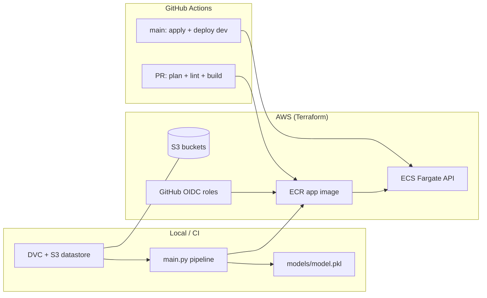

# MLOps — Insurance classifier

End-to-end MLOps project: versioned training data (DVC + S3), a scikit-learn pipeline (ingest → clean → train → evaluate), containerized FastAPI inference, and AWS infrastructure managed with Terraform and GitHub Actions.

| Area | Location | Documentation |
|------|----------|---------------|
| ML code, DVC, Docker (local) | [`src/`](src/) | [src/README.md](src/README.md) |
| Kubernetes (optional, MLflow registry) | [`k8s/`](k8s/) | [k8s/README.md](k8s/README.md) |
| AWS infrastructure | [`terraform/`](terraform/) | [terraform/README.md](terraform/README.md) |

## What is implemented today



- **Application**: Binary insurance claim classifier; FastAPI serves `GET /` (health) and `POST /predict`.
- **Data**: DVC tracks `src/data/`; remote default is `s3://mlops-postgrade-datastore-dev/data` (see `src/.dvc/config`).
- **CI (dev)**: Path-filtered pipeline on `main`. PR → Terraform fmt/plan (PR comment) + app lint/build (no deploy) + optional DVC check on `data.dvc`. Push to `main` → Terraform apply (manual approval, if `terraform/` changed) + retrain, Docker build, push to ECR (`:<short-sha>`), ECS rolling deploy with stability wait.
- **CI (prd)**: On PR to `release/**` → plan + verify dev ECR image exists for the commit. Production promote/deploy is implemented in `app-promote-reusable.yml` (copy image dev → prd ECR, update ECS task definition).
- **Runtime (AWS)**: **ECS Fargate** hosts the API (cheaper than EKS for coursework). **EKS manifests** under `k8s/` are an optional path when using MLflow Model Registry instead of baking `model.pkl` into the image.

## Repository layout

```text
mlops/
├── .github/workflows/
│   ├── dev-pipeline.yml          # main: path-filtered infra + app CI/CD
│   ├── prd-pipeline.yml          # release/**: infra + app verify/promote
│   ├── terraform-reusable.yml    # fmt, plan, manual-approval apply (OIDC)
│   ├── app-reusable.yml          # lint, dvc pull, train, build, ECR, ECS (dev)
│   ├── app-promote-reusable.yml  # verify / promote dev image → prd
│   └── data-reusable.yml         # DVC check when src/data.dvc changes
├── docs/
│   ├── pipeline-workflow.md      # CI/CD flow diagrams
│   ├── ml-application-flow.md    # Training and inference flow
│   ├── dvc-flow.md               # DVC data versioning cheat sheet
│   └── dvc-runbook.md            # Operational DVC guide
├── src/                          # Python app (see src/README.md)
├── terraform/                    # S3, ECR, ECS, GitHub OIDC (see terraform/README.md)
├── k8s/                          # Optional EKS + MLflow serving
└── README.md                     # This file
```

## Glossary

| Term | Meaning in this repo |
|------|---------------------|
| **DVC** (Data Version Control) | Tracks large files outside Git via `.dvc` metadata; stores blobs in S3. |
| **Datastore** | S3 bucket prefix used as the DVC remote (`mlops-postgrade-datastore-{env}`). |
| **ML pipeline** | `main.py`: ingest → clean → train → evaluate; configured in `src/config.yml`. |
| **Model artifact** | `src/models/model.pkl` (joblib pipeline: preprocess + SMOTE + classifier). |
| **MLflow** | Optional experiment tracking and Model Registry; training registers when `MLFLOW_TRACKING_URI` is set; serving can load from registry via `model_loader.py`. |
| **ECR** | Amazon container registry. Dev CI pushes `:<short-sha>` only. Prd promote pushes `:<sha>` and `:latest`. Initial ECS task definition references `:latest` in tfvars. |
| **ECS Fargate** | Serverless containers running the API; CI registers a new task definition and calls `update-service`, then waits for stability. |
| **OIDC** | GitHub Actions assumes IAM roles via OIDC (no long-lived keys): app workflows use `vars.AWS_ROLE_ARN`; Terraform CI uses `vars.AWS_TERRAFORM_ROLE_ARN`. |
| **IaC** | Terraform modules for S3, ECR, ECS, and two GitHub OIDC IAM roles (app + Terraform). See [terraform/README.md](terraform/README.md). |

## Prerequisites

- [Python](https://www.python.org/) 3.12–3.13, [Poetry](https://python-poetry.org/)
- [Docker](https://docs.docker.com/get-docker/)
- [Terraform](https://www.terraform.io/) ≥ 1.10
- [AWS CLI](https://aws.amazon.com/cli/) configured for your account
- [DVC](https://dvc.org/) with `dvc-s3` (installed via Poetry in `src/`)

## Infrastructure (Terraform)

Terraform provisions S3 (DVC remote), ECR, ECS Fargate, and **two** GitHub OIDC IAM roles:

| Role | Terraform module | Purpose |
|------|------------------|---------|
| `github-actions-mlops-app-dev` | `github-actions-oidc` | App CI: ECR push, S3/DVC, ECS deploy |
| `github-actions-mlops-terraform-dev` | `github-actions-terraform-oidc` | Terraform fmt/plan/apply in CI |

Environment tfvars (e.g. `environments/dev.tfvars`) also set `ecs_cluster_name` and `ecs_service_name` so the app OIDC role receives scoped ECS IAM permissions.

Full module layout, naming conventions, IAM details, and bootstrap steps: **[terraform/README.md](terraform/README.md)**.

### GitHub repository configuration

Set **repository or environment variables** (all workflows use OIDC — no long-lived AWS keys):

| Variable | Example source | Used by |
|----------|----------------|---------|
| `AWS_ROLE_ARN` | `terraform output github_actions_app_role_arn` | App / data workflows |
| `AWS_TERRAFORM_ROLE_ARN` | `terraform output github_actions_terraform_role_arn` | `terraform-reusable.yml` |
| `ECR_REPOSITORY` | `terraform output ecr_app_repository_name` | Build / promote |
| `ECS_CLUSTER_NAME` | `terraform output ecs_app_cluster_name` | Deploy |
| `ECS_SERVICE_NAME` | `terraform output ecs_app_service_name` | Deploy |
| `DEV_ECR_REPOSITORY` | Dev repo name (prd only) | `app-promote-reusable.yml` |

GitHub **environments**: `dev`, `prd` (Terraform apply on `main` requires manual approval in the `dev` environment).

OIDC trust subjects are in `terraform/github_actions_oidc.tf` and `terraform/github_actions_terraform_oidc.tf` (adjust `repo:owner/name` if you fork).

## CI/CD workflows

### Dev (`dev-pipeline.yml`)

Path filters control which jobs run (`terraform/**`, `src/**`, `src/data.dvc`, docs, workflow YAML).

| Event | Infra | Data | Application |
|-------|-------|------|-------------|
| PR to `main` | `terraform-reusable.yml`: fmt, plan (PR comment) | `data-reusable.yml` if `src/data.dvc` changed | `app-reusable.yml` with `deploy: false` |
| Push to `main` | apply (manual approval) if `terraform/**` changed | DVC check if `data.dvc` changed | `app-reusable.yml` with `deploy: true` |

When both infra and app change in the same push, the application job **waits** for a successful infrastructure apply before deploying.

Application job (`app-reusable.yml`), release step:

1. Ruff lint/format → `dvc pull` → `python main.py` → `docker build`
2. Push ECR image tagged with git short SHA (`:<short-sha>`)
3. ECS deploy (when `ECS_CLUSTER_NAME` / `ECS_SERVICE_NAME` are set):
   - `describe-services` → `describe-task-definition` → swap image → `register-task-definition`
   - `update-service` (log rollout state from API response)
   - `wait services-stable` → print final service status

Image is built from `src/Dockerfile` (includes `models/model.pkl` produced in the same job). Release runs in GitHub environment `dev`.

### Production (`prd-pipeline.yml` + `app-promote-reusable.yml`)

| Event | Behavior |
|-------|----------|
| PR to `release/**` | Terraform plan; **App — Verify** (lint + confirm image exists in dev ECR for commit) |
| Push to `release/**` | Terraform apply (when configured); promote copies dev image to prd ECR and registers new ECS task definition |

Promote flow does **not** rebuild from source: it `docker pull` dev tag → retag → push prd (`:<sha>` and `:latest`) → update ECS with the same stability wait and status logging as dev.

Manual promote: run **Application Promote** workflow with commit SHA and `release: true`.

## Accessing the deployed API (ECS)

With `enable_alb = false` (current dev/prd tfvars), tasks get a **public IP** on port 80. There is no stable hostname: `terraform output ecs_app_url` is null until you enable an ALB.

| Setting | Effect |
|---------|--------|
| `assign_public_ip = true` | Each Fargate task has a public IPv4 address |
| `enable_alb = false` | Security group allows HTTP from `0.0.0.0/0`; no load balancer |
| `enable_alb = true` | Use `terraform output ecs_app_url` → `http://<alb-dns>/` (~$16/mo extra; see `terraform/modules/ecs-fargate-service/README.md`) |

**Dev resource names** (prd: replace `dev` with `prd` — e.g. `ecs-app-prd`, `ecr-app-prd`, log group `/ecs/ecs-app-prd`):

| Resource | Dev name |
|----------|----------|
| ECS cluster / service | `ecs-app-dev` |
| ECR repository | `ecr-app-dev` |
| CloudWatch log group | `/ecs/ecs-app-dev` |
| Region | `eu-west-1` |

Set shell variables once (adjust for prd):

```bash
export AWS_REGION=eu-west-1
export ECS_CLUSTER=ecs-app-dev
export ECS_SERVICE=ecs-app-dev
export ECR_REPO=ecr-app-dev
```

### Get the task public IP (CLI)

```bash
TASK_ARN=$(aws ecs list-tasks \
  --cluster "$ECS_CLUSTER" \
  --service-name "$ECS_SERVICE" \
  --desired-status RUNNING \
  --region "$AWS_REGION" \
  --query 'taskArns[0]' --output text)

ENI=$(aws ecs describe-tasks \
  --cluster "$ECS_CLUSTER" \
  --tasks "$TASK_ARN" \
  --region "$AWS_REGION" \
  --query 'tasks[0].attachments[0].details[?name==`networkInterfaceId`].value' \
  --output text)

PUBLIC_IP=$(aws ec2 describe-network-interfaces \
  --network-interface-ids "$ENI" \
  --region "$AWS_REGION" \
  --query 'NetworkInterfaces[0].Association.PublicIp' \
  --output text)

echo "PUBLIC_IP=$PUBLIC_IP"
```

**Console:** ECS → Clusters → **ecs-app-dev** → Services → **ecs-app-dev** → Tasks → running task → **Networking** → **Public IP**.

### Call the API

| Endpoint | Method | Purpose |
|----------|--------|---------|
| `/` | GET | Health: `{"health_check":"OK"}` |
| `/predict` | POST | Inference |
| `/docs` | GET | Swagger UI |

```bash
curl "http://${PUBLIC_IP}/"

curl -X POST "http://${PUBLIC_IP}/predict" \
  -H "Content-Type: application/json" \
  -d '{"Gender":"Male","Age":49,"HasDrivingLicense":1,"RegionID":28,"Switch":0,"PastAccident":"1-2 Year","AnnualPremium":1885.05}'

curl -sS -o /dev/null -w "HTTP %{http_code}\n" "http://${PUBLIC_IP}/docs"
```

Browser: `http://<PUBLIC_IP>/docs`

## Testing (smoke checks)

1. **Local pipeline** — [src/README.md § Testing](src/README.md#testing)
2. **After CI deploy** — health + predict against ECS task IP (above)
3. **PR validation** — green **Dev — Build on PR** workflow (lint + Docker build)

Automated `pytest` suites are not checked in yet; CI relies on lint, training, and image build.

## Troubleshooting

### ECS (dev / prd)

Use the [environment variables](#accessing-the-deployed-api-ecs) above (`ECS_CLUSTER`, `ECS_SERVICE`, `ECR_REPO`, `AWS_REGION`). Work through these in order.

**A. Service and task health**

```bash
aws ecs describe-services \
  --cluster "$ECS_CLUSTER" \
  --services "$ECS_SERVICE" \
  --region "$AWS_REGION" \
  --query 'services[0].{status:status,running:runningCount,desired:desiredCount,pending:pendingCount,events:events[0:5]}'
```

- `runningCount = 0` → task failed to start; check CloudWatch logs and ECR tags (B–C below).
- `runningCount = 1` but `curl` times out → wrong/stale public IP, security group, or local firewall blocking outbound HTTP to the task IP.

**B. CloudWatch logs**

Log group: `/ecs/ecs-app-dev` (or `/ecs/ecs-app-prd`).

```bash
aws logs tail "/ecs/${ECS_SERVICE}" --region "$AWS_REGION" --since 1h --follow
```

Look for `CannotPullContainerError`, image not found, or Python tracebacks (e.g. missing `models/model.pkl` — the production `src/Dockerfile` copies `models/` at build time; CI must run `python main.py` before `docker build`).

**C. ECR image tags vs task definition**

Dev CI registers a new task definition pointing at `:<short-sha>`. If the running task still looks stale, compare ECR tags and the active task definition image:

```bash
aws ecr describe-images \
  --repository-name "$ECR_REPO" \
  --region "$AWS_REGION" \
  --query 'imageDetails[*].imageTags' \
  --output table

aws ecs describe-task-definition \
  --task-definition "$ECS_SERVICE" \
  --region "$AWS_REGION" \
  --query 'taskDefinition.containerDefinitions[0].image' \
  --output text
```

If deploy was skipped (no `src/**` change), re-run the workflow on `main` or push a small `src/` change.

**D. Recent stopped tasks**

```bash
STOPPED=$(aws ecs list-tasks \
  --cluster "$ECS_CLUSTER" \
  --service-name "$ECS_SERVICE" \
  --desired-status STOPPED \
  --region "$AWS_REGION" \
  --max-items 3 \
  --query 'taskArns' --output text)

aws ecs describe-tasks \
  --cluster "$ECS_CLUSTER" \
  --tasks $STOPPED \
  --region "$AWS_REGION" \
  --query 'tasks[*].{stoppedReason:stoppedReason,containers:containers[*].{reason:reason,exitCode:exitCode}}'
```

**E. Force a new deployment**

```bash
aws ecs update-service \
  --cluster "$ECS_CLUSTER" \
  --service "$ECS_SERVICE" \
  --force-new-deployment \
  --region "$AWS_REGION"
```

Or re-run the **Dev — Build on PR, Release on main** workflow on `main` (with `deploy: true` on merge).

**F. Stable URL (optional)**

```bash
# In terraform/environments/dev.tfvars set enable_alb = true, then:
cd terraform
terraform apply -var-file=environments/dev.tfvars
terraform output ecs_app_url
```

With ALB enabled, tasks only accept HTTP from the load balancer, not directly from the task public IP.

**G. Local baseline (app vs AWS)**

If ECS fails but the app is fine locally, see [src/README.md](src/README.md): `dvc pull`, Docker on `localhost:8080`, curl `/` and `/predict`.

### General

| Symptom | Likely cause | What to do |
|---------|----------------|------------|
| `dvc pull` / `403` on S3 | AWS credentials or wrong remote URL | `aws sts get-caller-identity`; check `src/.dvc/config` matches `terraform output bucket_ids` |
| CI: `Set repository variable AWS_ROLE_ARN` | Missing GitHub vars | Apply Terraform; copy outputs to repo/environment variables |
| CI: OIDC assume role failed | Trust policy `sub` mismatch | Compare workflow log `sub=` with `allowed_subjects` in `github_actions_oidc.tf` or `github_actions_terraform_oidc.tf` |
| CI: ECS `AccessDenied` on deploy | App role missing ECS IAM | Apply Terraform; ensure `ecs_cluster_name` / `ecs_service_name` in tfvars; task-def actions need `Resource: "*"` (see [terraform/README.md](terraform/README.md)) |
| Docker build: `models/` missing | Train skipped locally | Run `python main.py` or `docker compose run --rm train` before `docker build` |
| API returns 500 on `/predict` | No model in container | Local: mount `models/`; ECS: ensure CI train step ran before image build |
| ECS deploy OK but old behavior | Task still on old image | ECR tags + task definition image (§ C above); force new deployment (§ E) |
| `pathspec` / DVC import error | Incompatible `pathspec` 1.x | Use Poetry lockfile (`pathspec < 1.0` pinned in `pyproject.toml`) |
| Plan/apply fails in GHA | OIDC role or backend | Set `AWS_TERRAFORM_ROLE_ARN`; approve manual apply issue; `terraform init -backend-config=...` locally |

## Optional: EKS + MLflow

For registry-based models (no `model.pkl` in the image), see [k8s/README.md](k8s/README.md): build `src/Dockerfile` (production serve) and `src/docker/train/Dockerfile`, push to ECR, set `MLFLOW_*` env vars.

## Further reading

- [docs/pipeline-workflow.md](docs/pipeline-workflow.md) — CI/CD flow diagrams (dev + prd)
- [docs/ml-application-flow.md](docs/ml-application-flow.md) — training, Docker, inference flow
- [docs/dvc-flow.md](docs/dvc-flow.md) — Git + DVC + S3 data versioning cheat sheet
- [src/README.md](src/README.md) — DVC, training, Docker Compose, local API testing, ML troubleshooting
- [docs/dvc-runbook.md](docs/dvc-runbook.md) — operational DVC verification and datastore workflow
- [terraform/README.md](terraform/README.md) — modules, OIDC IAM, outputs, environments
- [terraform/modules/ecs-fargate-service/README.md](terraform/modules/ecs-fargate-service/README.md) — ECS costs and ALB option
- [terraform/modules/s3-bucket/README.md](terraform/modules/s3-bucket/README.md) — DVC datastore bucket module
